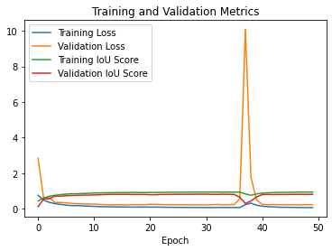
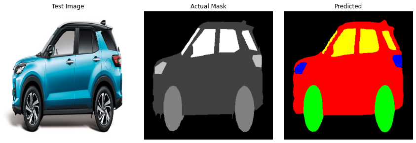

# Car Segmentation using PSPNet

This repository contains Python scripts for training and predicting with a PSPNet model for semantic segmentation of car images.

## Requirements

- Python 3.x
- TensorFlow
- segmentation_models
- NumPy
- Matplotlib

You can install the required packages using the following command:

```bash
pip install -r requirements.txt
Usage
1. Training the Model
bash
python train_model.py
Set the necessary paths and parameters in the script.
Ensure that the dataset is organized with image and mask directories.
2. Predicting with the Trained Model
bash
python predict_model.py
Set the model path, image path, input shape, and class labels in the script.
Ensure that the model is trained with the same class labels.
Model Files
The trained model is saved as PSPNet_densenet121_model.h5.
The prediction script uses this model for semantic segmentation.
Example
See the example in predict_model.py for loading the trained model and making predictions on a test image.
## Results

Below are the input and output images:

### Training Loss , Validation Loss , Training IoU Score And Validation IoU Score



**Figure 1:** Training image for segmentation.

### Output Image



**Figure 2:** Output image with the car, original mask, and predicted mask.

## Dataset

The Car Segmentation dataset used in this project can be downloaded from Kaggle. It includes images of cars along with corresponding segmentation masks.

To download the dataset, you can use the following command:

```bash
kaggle datasets download -d intelecai/car-segmentation
After downloading the dataset, make sure to organize it with separate directories for images and masks before using the training script.

The dataset is provided by Intelecai on Kaggle. Please refer to the dataset's Kaggle page for additional details.

Feel free to explore and use the dataset for training and testing the segmentation model.

License
This project is licensed under the MIT License.

Feel free to contribute and open issues if you encounter any problems.
